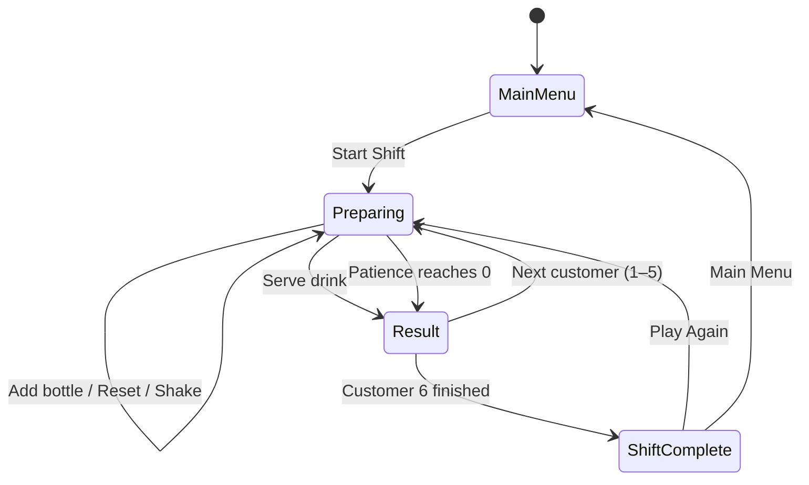
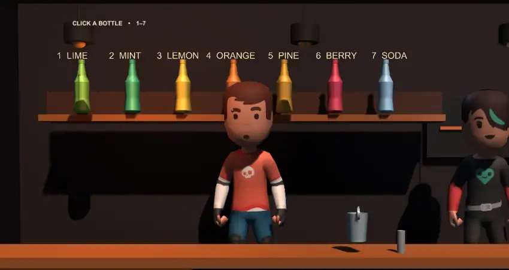
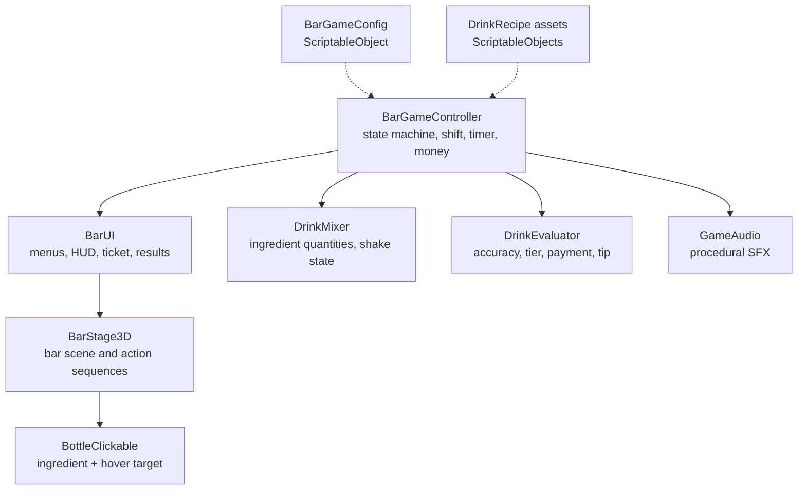

# Game Design Document — *BarShift: Mix & Serve*

| | |
|---|---|
| **Working title** | BarShift: Mix & Serve |
| **Team** | Shadi — design and development |
| **Genre** | 3D bartending / time-management / score game |
| **Target platform** | PC (Windows), standalone build |
| **Engine / Unity version** | Unity 6 LTS (6000.3.20f1), Built-in Render Pipeline, 3D |
| **Orientation & reference resolution** | Landscape, 1920 × 1080 reference |
| **Expected session length** | 3-5 minutes per six-customer shift |
| **Document version** | v1.0 — 2026-10-03 |

---

## 1. High Concept

The player works one short bar shift serving six customers. Each customer shows an exact drink ticket. The player clicks bottles on a 3D shelf, pours ingredient units into a mixing cup, shakes only when required, and serves before patience runs out. Accuracy, technique, and speed determine the reaction, payment, and tip.

### Design pillars

1. **Readable orders, meaningful mistakes** — the full recipe is always visible, so failure comes from the player's decisions rather than hidden information. This rules out secret recipes and random scoring.
2. **Physical bar interaction** — ingredients are chosen from visible bottles and actions are shown through short pour, shake, and serve sequences. This rules out a menu-only preparation screen.
3. **Small polished shift** — the complete game is one six-customer session with a clear result and best score. This rules out inventory management, upgrades, story progression, and multiple locations.

---

## 2. Reference & Inspiration

- **Primary reference:** [Bartender: The Right Mix](https://www.y8.com/games/bartender_the_right_mix). Taking: a visible bottle shelf, direct bottle selection, a clear shake/serve flow, and an immediate reaction after serving. Not taking: alcohol brands, exaggerated failure scenes, free-form real-world cocktail mixing, or the original visual style.
- **Secondary reference:** [Papa's Freezeria](https://www.flipline.com/games/papasfreezeria/). Taking: order → prepare → score/reaction → payment pacing. Not taking: multiple work stations, unlockable ingredients, upgrades, lobby decoration, or long-term progression.
- **Video:** [Papa's Freezeria official trailer / gameplay reference](https://www.youtube.com/watch?v=DV-5KWtcd_g) — useful for the short order-to-preparation-to-result rhythm.

---

## 3. Core Game Loop

**Moment-to-moment rules** — the things that are true every frame:

- A shift contains exactly **6 customers**. Each customer receives one of six predefined `DrinkRecipe` assets.
- Clicking a bottle or pressing keys `1–7` adds exactly **one unit** of that ingredient. The mixing cup cannot exceed `maxUnitsInGlass`.
- The order ticket stays visible during preparation and states exact quantities plus **Shake** or **Do not shake**.
- The patience timer decreases only while the game is in the `Preparing` state. Pour, shake, and serve action sequences temporarily lock input so actions cannot overlap.
- `Reset` clears all ingredient quantities and the shake state before serving.
- `Shake` is allowed after at least one ingredient is present and can be performed once per drink.
- **Scoring:** on Serve, the evaluator compares expected and actual ingredient units, then applies a technique multiplier if the shake/no-shake instruction is wrong. The resulting tier is Perfect, Good, Bad, or Terrible; payment and tip are calculated from that tier and remaining patience.
- **Failure:** there is no instant game-over. If patience reaches zero, the customer leaves, earns $0, counts as served, and the next customer begins. The shift ends after customer 6.

### Parameters you will need to tune

| Parameter | What it controls | First guess |
|---|---|---:|
| `customersPerShift` | Number of orders before the shift summary | 6 |
| `customerPatienceSeconds` | Time available to prepare one drink | 42 |
| `perfectThreshold` | Minimum final accuracy for Perfect | 0.93 |
| `goodThreshold` | Minimum final accuracy for Good | 0.72 |
| `badThreshold` | Minimum final accuracy for Bad | 0.45 |
| `wrongTechniqueMultiplier` | Penalty for shaking when the ticket says not to, or not shaking when required | 0.82 |
| `perfectTip` | Base tip for a Perfect result | $6 |
| `goodTip` | Base tip for a Good result | $3 |
| `fastBonusTip` | Extra tip for fast service | $2 |
| `fastBonusThreshold` | Patience ratio needed for the speed bonus | 0.55 |
| `maxUnitsInGlass` | Maximum ingredient units before the cup is considered full | 12 |

**Where these live:** a `BarGameConfig` ScriptableObject at `Assets/Resources/Data/BarGameConfig.asset`, so the main balance values can be changed in the Inspector without recompiling scripts.

**Feel target:** a first-time player should understand how to complete a valid drink during the first customer, while careful players should be able to earn at least several Good/Perfect results in one six-customer shift without memorizing recipes.

---

## 4. Controls & Input

| Action | Keyboard / Mouse | Gamepad | Touch |
|---|---|---|---|
| Add ingredient | Click bottle / `1–7` | Not supported | Not supported |
| Reset drink | Reset button / `R` | Not supported | Not supported |
| Shake | Shake button / `S` | Not supported | Not supported |
| Serve | Serve button / `Enter` | Not supported | Not supported |
| Menu navigation | Mouse click | Not supported | Not supported |

- Gameplay input is read in `Update` while the controller is in the `Preparing` state. This game does not depend on physics-step timing, so there is no `FixedUpdate` input buffer.
- The gameplay Canvas is configured so it does not block the 3D shelf raycast. Bottle selection uses the 3D camera and bottle colliders; UI buttons handle their own clicks.
- During pour, shake, and serve sequences, `actionLocked` is true. Additional ingredient/actions are ignored until the sequence finishes. Result and shift-complete screens accept only their visible UI buttons.

---

## 5. Screens & UI

1. **Main Menu** — game title, `START SHIFT`, `HOW TO PLAY`, `QUIT`, and saved best-shift earnings.
2. **How To Play** — explains bottle selection, exact ingredient units, the shake/no-shake rule, patience, and keyboard shortcuts.
3. **Gameplay** — 3D bar, raised ingredient shelf, bartender and customer behind the counter, order ticket, patience bar, earnings, customer counter, current drink panel, and `RESET`, `SHAKE`, `SERVE` buttons.
4. **Customer Result** — reaction tier, accuracy, preparation feedback, payment, tip, total earned, and a button to continue.
5. **Shift Complete** — total earnings, saved best score, Perfect/Good/Bad/Terrible counts, `PLAY AGAIN`, and `MAIN MENU`.

- **HUD during play:** top bar shows current earnings, customer number, saved best score, and remaining patience. The ticket shows only information required to prepare the current drink. There is no minimap, inventory, XP bar, upgrade currency, or quest UI.
- **Canvas setup:** runtime uGUI Canvas with `CanvasScaler` using **Scale With Screen Size**, reference resolution **1920 × 1080**. The 3D scene stays visible behind the HUD, and the main action buttons remain in a fixed bottom area.

---

## 6. Art & Audio

| Asset | Variants / frames | Source & licence | Use |
|---|---|---|---|
| Character model | One shared rig, two skins used | Kenney — *Animated Characters 2*, CC0 | Bartender and customer |
| Character animation | Idle + short reaction animation clips | Kenney — *Animated Characters 2*, CC0 | Idle motion and positive reaction |
| Bottle model | One model recolored for 7 ingredients | Kenney — *Food Kit*, CC0 | Clickable ingredient shelf |
| Glass / mixing cup | One model | Kenney — *Food Kit*, CC0 | Pour, shake, and serve object |
| Counter, shelf, lamps, simple tools | Runtime Unity primitives | Created in project | Bar environment and composition |
| UI panels / buttons / ticket | Runtime uGUI | Created in project | Menus, HUD, order and result screens |
| SFX | Procedural tones/noise | Generated by `GameAudio.cs` | Click, pour, shake, result, coin feedback |

**Licence note:** the Kenney assets used by the project are distributed under Creative Commons Zero (CC0), so they can be used and modified in the course project and in a public build. Credit is not legally required, but the repository includes `CREDITS.md` and asset-source notes for clarity. No copyrighted alcohol brands or unlicensed images are part of the playable build.

**Technical art rules:** low-poly/stylized 3D, warm dark bar palette, ingredient bottles reuse one model with per-ingredient colors, characters stay behind the counter, the bottle shelf is raised so every item remains visible, ingredient names are placed above their bottles, and the order ticket uses a light background for maximum readability.

---

## 7. Technical Design

**Scenes:** one scene, `Assets/Scenes/Game.unity`. A runtime bootstrap creates the game systems when the scene loads; starting a new shift resets game state rather than reloading the scene.

**Packages / systems used:** Unity uGUI, built-in 3D rendering, colliders + camera raycasts for bottle selection, coroutines for timed action sequences, ScriptableObjects for configuration/recipes, and `PlayerPrefs` for the best score.

**Target device:** Windows desktop/laptop with mouse and keyboard, 1920 × 1080 demo resolution.

**Architecture:**

| Script | Responsibility |
|---|---|
| `BarGameController.cs` | Owns game state, customer loop, patience timer, earnings, input routing, and best score |
| `BarUI.cs` | Creates and updates menus, gameplay HUD, order ticket, result and shift-complete screens |
| `BarStage3D.cs` | Builds the 3D bar scene and runs bottle pour, cup shake, serve, and reaction sequences |
| `BottleClickable.cs` | Stores one bottle's `IngredientType` and provides hover feedback for raycast selection |
| `DrinkMixer.cs` | Stores current ingredient unit counts and whether the current drink was shaken |
| `DrinkEvaluator.cs` | Compares recipe vs. player drink and calculates tier, payment, tip, and feedback |
| `DrinkRecipe.cs` | ScriptableObject definition for drink name, ingredients, technique, price, text, and color |
| `BarGameConfig.cs` | ScriptableObject containing the main balance/tuning parameters |
| `IngredientType.cs` | Ingredient enum plus display names and ingredient colors |
| `CustomerData.cs` | Lightweight customer presentation data used by the shift loop |
| `GameAudio.cs` | Generates simple SFX at runtime without external audio files |

### The course features you are implementing

1. **ScriptableObjects** — `DrinkRecipe` and `BarGameConfig` keep recipes and tuning data outside the gameplay code. This is the right tool because recipes/balance values can be edited in the Inspector without changing or recompiling the controller.
2. **Coroutines** — pour, shake, serve, and reaction sequences run over a short duration while `actionLocked` prevents overlapping input. Coroutines fit these small ordered sequences better than a full animation state machine.
3. **3D raycasting and colliders** — each bottle has a forgiving collider and the stage raycasts from the gameplay camera to select it. This makes the shelf itself the input surface instead of replacing the bar with UI buttons.
4. **Collections / dictionaries** — `DrinkMixer` stores quantities by `IngredientType`, and the 3D stage maps each ingredient to its clickable/visual bottle. This avoids separate fields and repeated code for every ingredient.
5. **Explicit game-state machine** — `MainMenu`, `Instructions`, `Preparing`, `ShowingResult`, and `ShiftComplete` control which systems accept input and which screen is visible. This prevents actions from leaking into menus/results.
6. **PlayerPrefs** — only the best shift earnings persist. It is appropriate because the project needs one small local value, not a full save-file system.

---

## 8. Scope

### 8.1 MVP — the game is not a game without these

- [x] Main menu and How To Play screen
- [x] Six drink recipes with exact ingredient quantities
- [x] Seven selectable ingredients
- [x] Reset / Shake / Serve actions
- [x] Accuracy and shake/no-shake evaluation
- [x] Customer patience timer
- [x] Four result tiers with payment and tips
- [x] Six-customer shift loop
- [x] Shift summary and persistent best earnings
- [x] Mouse and keyboard controls

### 8.2 Polish — if the MVP is done and playable

- [x] 3D bartender and customer behind the bar
- [x] Clickable raised bottle shelf with hover feedback
- [x] Ingredient names placed above bottles for readability
- [x] Bottle-to-cup pour sequence
- [x] Mixing-cup shake sequence
- [x] Cup-to-customer serve sequence
- [x] Dynamic drink fill/color feedback
- [x] Short customer reaction movement
- [x] Procedural sound effects
- [x] Final dark-bar / warm-accent visual theme

### 8.3 Explicitly out of scope — we are **not** building these

- Multiplayer, online leaderboards, accounts, or any online service
- Multiple bar locations, free-roaming character movement, or a large explorable level
- Inventory purchasing, stock management, upgrades, staff management, or economy simulation
- Story campaign, branching dialogue, quests, achievements, or character progression
- Real alcohol brands or accurate real-world cocktail recipes
- Mobile/touch build or gamepad support
- Procedural/random recipe generation
- A save system beyond the single `PlayerPrefs` best-shift value

---

## Changelog

| Version | Date | Change |
|---|---|---|
| v0.1 | 2026-09-25 | Initial drink-order concept, recipe system, patience, payment, and six-customer shift |
| v0.2 | 2026-09-28 | Added runtime UI, result screens, ScriptableObject recipes/config, and keyboard controls |
| v0.3 | 2026-10-01 | Replaced the prototype-only presentation with a visible 3D bar, bartender/customer models, and clickable bottles |
| v0.4 | 2026-10-02 | Added pour, shake, serve, and customer-reaction sequences; improved bottle click areas and scene readability |
| v1.0 | 2026-10-03 | Finalized character placement behind the bar, raised shelf, labels above bottles, mixing-cup shake, and final scope/documentation |
